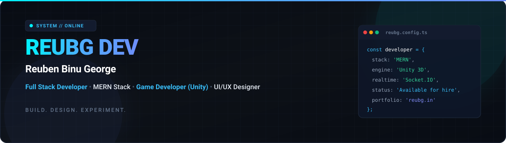
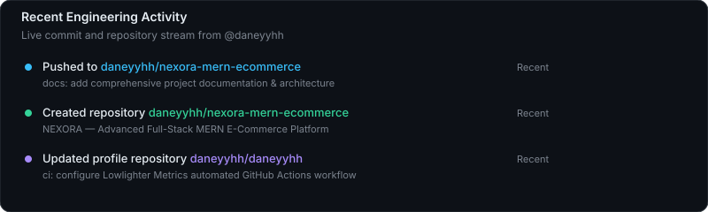

<div align="center">
  
</div>

<div align="center">
  <br />

  [](https://reubg.in)
  [](https://github.com/daneyyhh)
  [](https://github.com/daneyyhh?tab=repositories)
  [](mailto:daneyyhh64@gmail.com)

  <br />
</div>

---

### ✦ Architecture & Engineering Focus

I am **Reuben Binu George** (**REUBG DEV**), a Full Stack and Game Developer dedicated to engineering high-performance web systems, real-time architectures, and interactive 3D simulations. 

* **Full-Stack Web Engineering**: Deep specialization in the **MERN Stack** (MongoDB, Express, React, Node.js), event-driven WebSockets with **Socket.IO**, and responsive UI architectures using **Tailwind CSS** and **Vite**.
* **Game Development & Physics**: Building 3D physics-based mechanics, obstacle dynamics, and interactive simulations in **Unity** with **C#**.
* **Interface & Human Interaction**: Designing clean, high-contrast, technical design systems in **Figma** and bringing them to life with **Three.js** and fluid modern CSS.

> *"Build. Design. Experiment."* — Architecting production-grade software with clean separations of concern, atomic state management, and intuitive user experiences.

---

### 🛠️ Technical Arsenal

<div align="center">

| Domain | Technologies & Frameworks |
| :--- | :--- |
| **Frontend** |        |
| **Backend & Real-Time** |      |
| **Databases** |    |
| **Languages** | -F7DF1E?style=flat-square&logo=javascript&logoColor=black)    |
| **Game Development** |    |
| **Design & UI/UX** |    |
| **Tools & DevOps** |      |

</div>

---

### 🚀 Featured Engineering Projects

#### 1. [NEXORA — Advanced Full-Stack MERN E-Commerce Platform](https://github.com/daneyyhh/nexora-mern-ecommerce)
*Production-grade, architectural e-commerce platform bridging storefront actions with real-time admin fulfillment.*
* **Stack**: `React 18` • `Node.js` • `Express` • `MongoDB` • `Socket.IO` • `Tailwind CSS` • `Vite`
* **Real-Time Bidirectional WebSockets**: Placing an order triggers live audio alerts and updates admin revenue/order metrics instantaneously; admin status updates immediately advance customer tracking timelines.
* **Strict 2-Image Photography Rule**: Schema-validated requirement enforcing exactly two perspective photos (Front/45° and Side/Rear) per product finish with silky smooth card hover crossfade.
* **Dynamic Variant Swapping**: Interactive color swatches swap the gallery images, price, SKU, and stock dynamically.
* **Fulfillment Pipeline**: 4-step checkout, coupon engine (min spend, percentage/fixed, discount caps), address book modal, and live 7-stage dispatch tracker (`Pending` ➔ `Delivered`).
* **Zero-Config Database**: Seamless dual-mode connection with automatic embedded persistent MongoMemoryServer fallback.

#### 2. [3D Bouncing Ball Game — Unity Physics Platformer](https://github.com/daneyyhh/3d-bouncing-ball-game)
*Interactive 3D platformer featuring realistic Newtonian physics and dynamic environment hazards.*
* **Stack**: `Unity 3D` • `C#` • `RigidBody Physics` • `Shader Graph`
* **Mechanics**: Precision momentum retention, air-control velocity modulation, and trajectory dynamics.
* **Dynamic Hazards**: Water buoyancy simulation, jumpable obstacles, spike collision damage, and heart health recovery pickups.

#### 3. [AI Chess Game — Interactive Engine & Board](https://github.com/daneyyhh/ai-chess-game)
*Full-featured AI chess web application featuring player-versus-machine gameplay.*
* **Stack**: `JavaScript` • `Minimax Algorithm` • `Alpha-Beta Pruning` • `CSS3 Animations`
* **Chess Engine**: Complete move validation covering castling, en passant, check/checkmate detection, and pawn promotion.
* **AI Evaluation**: Heuristic board evaluation with configurable recursive search depth, move history log, and captured piece counts.

#### 4. [Personal Portfolio — Interactive Experience](https://github.com/daneyyhh/portfolio)
*Distinctive developer portfolio exploring terminal-style interactions and pixel art aesthetics.*
* **Stack**: `JavaScript` • `CSS3` • `HTML5 Canvas` • `Vercel`
* **Live Demo**: [reubg.in](https://reubg.in)

#### 5. [Enterprise Resource Planning (ERP) System](https://github.com/daneyyhh/erp_system)
*Full-stack business management application with modular administrative operations.*
* **Stack**: `PHP` • `MySQL` • `CSS3` • `Vercel`
* **Live Demo**: [erp-system-umber-delta.vercel.app](https://erp-system-umber-delta.vercel.app)
* **Features**: Role-based access control, inventory management workflows, and order lifecycle management.

#### 6. [Astrobot — Multi-Purpose Discord Automation](https://github.com/daneyyhh/astrobot-discord)
*Production Discord bot with modular command architecture for moderation and community management.*
* **Stack**: `Node.js` • `Discord.js v14` • `REST API`
* **Features**: 20+ specialized commands for server administration, user auditing, and automation.

---

### 📊 Live GitHub Analytics

Driven by **[Lowlighter Metrics](https://github.com/lowlighter/metrics)** and updated automatically via **GitHub Actions** (`.github/workflows/metrics.yml`).

<div align="center">
  
</div>

<br />

#### 📅 Isometric Contribution Calendar
<div align="center">
  
</div>

<br />

#### ⚡ Recent Engineering Activity
<div align="center">
  
</div>

---

### 🌐 Connect & Collaborate

<div align="center">

[](https://reubg.in)
[](https://reubg.dev)
[](https://github.com/daneyyhh)
[](mailto:daneyyhh64@gmail.com)

<br />

```text
REUBG DEV // Reuben Binu George
Full Stack Developer • Game Developer • UI/UX Designer
Bengaluru, India • Available for Full-Time Roles & High-Impact Contracts
```

</div>
